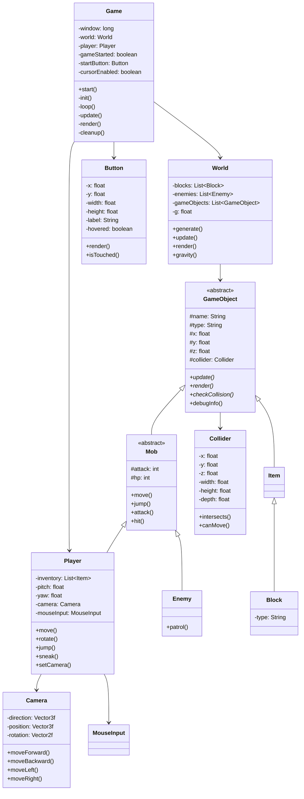

# マインクラフト風のLWJGLを使ったゲーム
**プログラミングの課題で好きな作品を作るらしいのでJAVAといえばマインクラフトだと思い、作ろうとした**
- オブジェクト指向のいい練習にもなるだろうし...

## クラス図を書いた(mermaid)

## 試したこと
- ビットマップフォントを使えるようにしようとした
    - 非常にめんどくさかった
    - あきらめた()

## インストールInstallation
リリースノート
