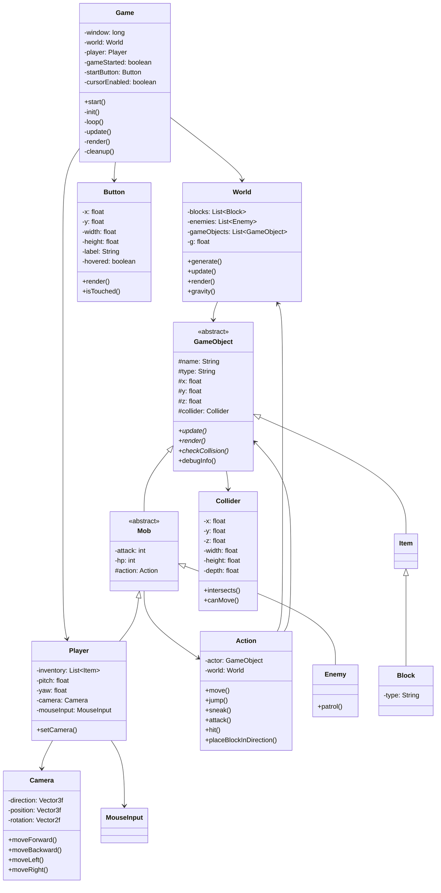

# マインクラフト風のLWJGLを使ったゲーム
**プログラミングの課題で好きな作品を作るらしいのでJAVAといえばマインクラフトだと思い、作ろうとした**

 オブジェクト指向のいい練習にもなるだろうし...

- 画像：最新版のワールドの画面

### LWJGLの厄介ポイント
- macOSの場合jvmの引数に"-XstartOnFirstThread"をつけないといけない **(逆にwindowsはこの設定は消してください)**
  - VScodeで実行する場合setting.jsonにこれを書き込むと解決できる。
    ```.vscode/setting.json
        "java.test.config": {
        "vmArgs": ["-XstartOnFirstThread"]
    }
    ```


## クラス図を書いた(mermaid)

## ソースコードを実行するには
 - java開発環境、Gradleが必要
 - macの場合
     - "vmArgs"に "-XstartOnFirstThread"を追加
- windowsではいらない
- Mainクラスを実行するとゲーム画面が起動する

## ゲームの操作方法
1. 再生ボタンのようなボタンが出てくるからそれをクリックする
2. WASDで移動でき、マウス操作で視点操作ができる。
3.  ESCキーでマウスカーソルの表示・非表示を切り替えられる
4.  マウスをクリックすると視点と同じ方向にブロックを置ける

## 試したこと
- ビットマップフォントを使えるようにしようとした
    - 非常にめんどくさかった
    - あきらめた()
- 視点操作
    - 調べたらカメラクラスとマウスインプットクラスがあってそれをコピーした
    - https://lwjglgamedev.gitbooks.io/3d-game-development-with-lwjgl/content/chapter08/chapter8.html
    - https://zenryokuservice.com/wp/2022/12/03/java-3d-lwjgl-gitbook-%E3%80%9C%E3%82%AB%E3%83%A1%E3%83%A9chapter08%EF%BC%9A%E3%82%AB%E3%83%A1%E3%83%A9%E3%82%92%E5%8B%95%E3%81%8B%E3%81%99%E3%81%A8%E3%81%AF%E3%80%9C/
- ブロックの描画
  - 楽に書けてオブジェクト指向のありがたみを感じる
  - 描画も3次元で線や面が描けるので思ったより簡単だった
    - AIはこういうときミスをしてたりする。
## 気づいたこと
`JUnitでユニットテストを記述すること。`を10回コミットした時にみてTDDについて知った。もう少し早く知っておけばよかった。
今から動作しないテストを書きます。

## インストールInstallation
[ここからインストール(ver1.0)](https://github.com/p-nasimonan/Minicraft/releases/download/v1.0/minicraft-1.0.jar)
