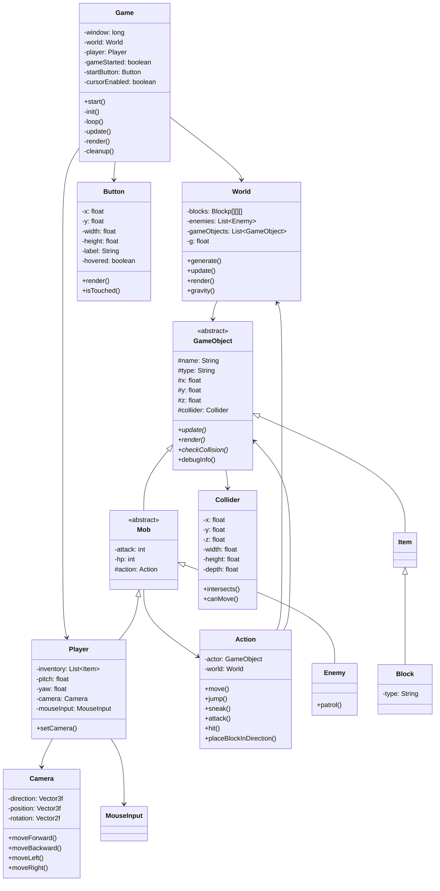

# マインクラフト風のLWJGLを使ったゲーム
**プログラミングの課題で好きな作品を作るらしいのでJAVAといえばマインクラフトだと思い、それっぽいのを作ろうとした**

 オブジェクト指向のいい練習にもなるだろうし...


- 画像：最新版のワールドの画面

## インストールInstallation
### [ここからダウンロード(ver1.01)](https://github.com/p-nasimonan/Minicraft/releases/download/v1.01/minicraft-1.01.jar)

### LWJGLの厄介ポイント
- macOSの場合jvmの引数に"-XstartOnFirstThread"をつけないといけない **(逆にwindowsはこの設定は消してください)**
  - VScodeの開発環境で実行する場合.vscode内のjsonファイルを書き換える必要がある
  - launch.json
    ```.vscode/launch.json
    "vmArgs": "-XstartOnFirstThread",
    ```
    setting.json
    ```.vscode/setting.json
        "java.test.config": {
        "vmArgs": ["-XstartOnFirstThread"]
    }
    ```
  を追加したらテストも実行できるようになる

## ゲームの操作方法
1. 再生ボタンのようなボタンが出てくるからそれをクリックする
2. WASDで移動でき、マウス操作で視点操作ができる。
3.  ESCキーでマウスカーソルの表示・非表示を切り替えられる
4.  マウスをクリックすると視点と同じ方向にブロックを置ける

## ソースコードを実行するには
 - java開発環境、Gradleが必要
 - Gradle経由で起動するのが推奨（依存関係やネイティブ設定が自動で処理されます）
 - Mainクラスを実行するとゲーム画面が起動します


### 実行方法（Gradleで実行する方法）

#### 開発中（Gradleで実行）
Gradleの `application` プラグインで立ち上げる方法です。依存関係やネイティブライブラリが正しく組み込まれるため、開発中はこの方法を推奨します。

- macOS / Linux:
```bash
./gradlew :app:run
```

#### 実行用JAR（オプション）
ビルドして配布用のJarを作成して実行する方法です。

ビルド:
```bash
./gradlew :app:fatJar
```

- macOS（ターミナル）:
```bash
java -XstartOnFirstThread -jar app/build/libs/minicraft-1.01.jar
```

Windowsではjarをダブルクリックして実行することもできます。

## クラス図を書いた(mermaid)

```mermaid
classDiagram
    class Game {
        -window: long
        -world: World
        -player: Player
        -gameStarted: boolean
        -startButton: Button
        -cursorEnabled: boolean
        +start()
        -init()
        -loop()
        -update()
        -render()
        -cleanup()
    }

    class GameObject {
        <<abstract>>
        #name: String
        #type: String
        #x: float
        #y: float
        #z: float
        #collider: Collider
        +update()*
        +render()*
        +checkCollision()*
        +debugInfo()
    }

    class World {
        -blocks: Blockp[][][]
        -enemies: List~Enemy~
        -gameObjects: List~GameObject~
        -g: float
        +generate()
        +update()
        +render()
        +gravity()
    }

    class Player {
        -inventory: List~Item~
        -pitch: float
        -yaw: float
        -camera: Camera
        -mouseInput: MouseInput
        +setCamera()
        
    }
    class Action {
        -actor: GameObject
        -world: World
        +move()
        +jump()
        +sneak()
        +attack()
        +hit()
        +placeBlockInDirection()
    }

    class Mob {
        <<abstract>>
        -attack: int
        -hp: int
        #action: Action
    }

    class Enemy {
        +patrol()
    }

    class Item {
    }

    class Block {
        -type: String
    }

    class Camera {
        -direction: Vector3f
        -position: Vector3f
        -rotation: Vector2f
        +moveForward()
        +moveBackward()
        +moveLeft()
        +moveRight()
    }

    class Button {
        -x: float
        -y: float
        -width: float
        -height: float
        -label: String
        -hovered: boolean
        +render()
        +isTouched()
    }

    class Collider {
        -x: float
        -y: float
        -z: float
        -width: float
        -height: float
        -depth: float
        +intersects()
        +canMove()
    }

    Game --> World
    Game --> Player
    Game --> Button
    World --> GameObject
    GameObject <|-- Mob
    GameObject <|-- Item
    Item <|-- Block
    Mob <|-- Player
    Mob <|-- Enemy
    Player --> Camera
    Player --> MouseInput
    Mob --> Action
    Action --> World
    Action --> GameObject
    GameObject --> Collider
```